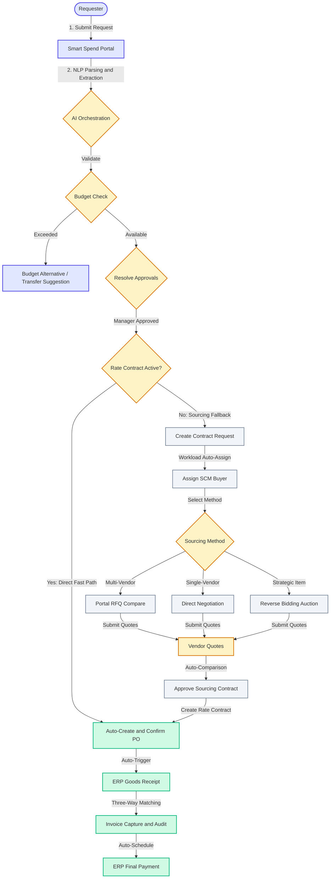
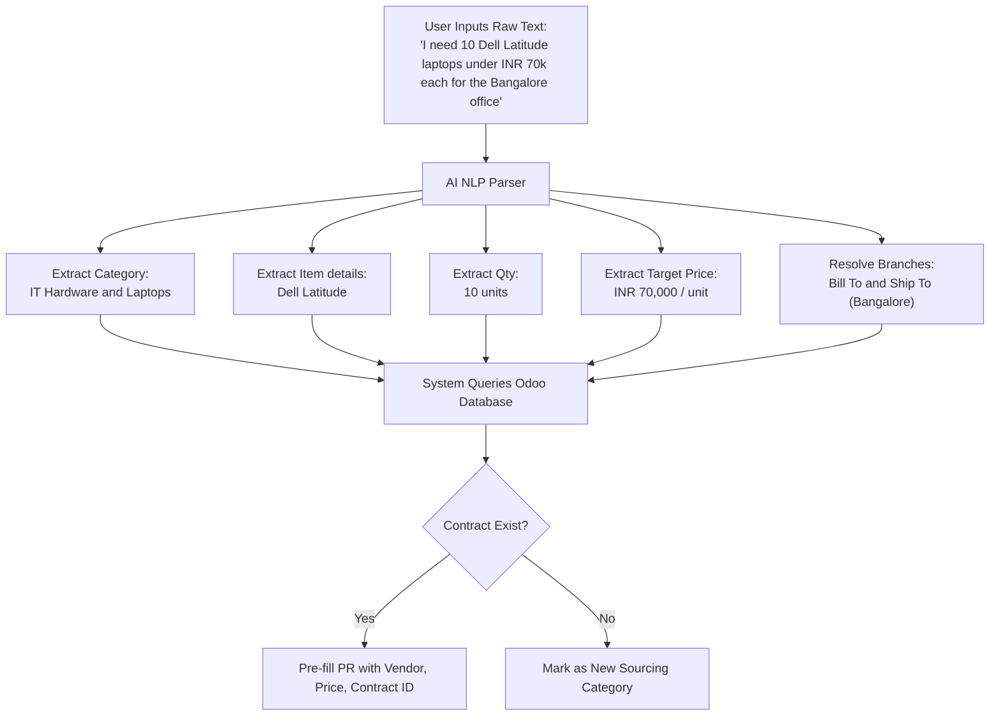
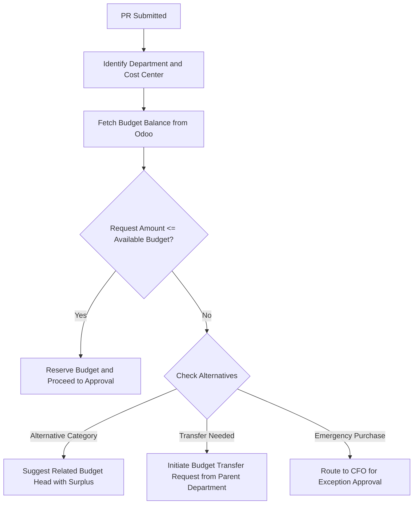
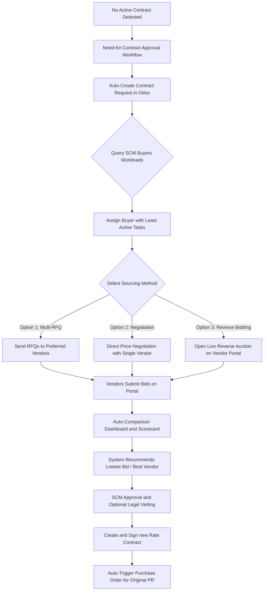
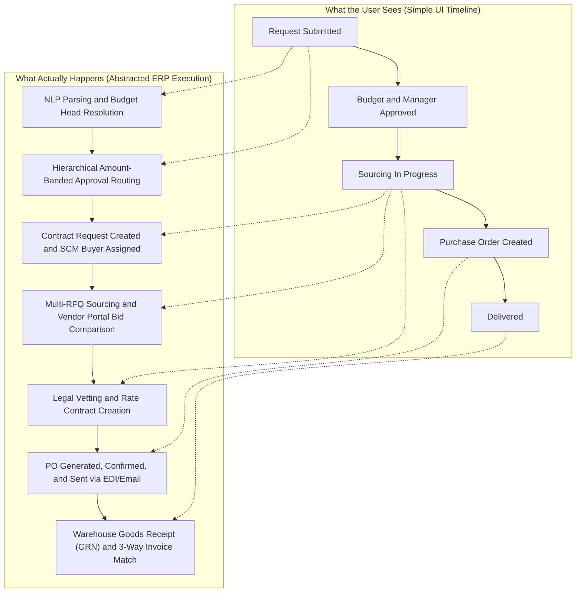
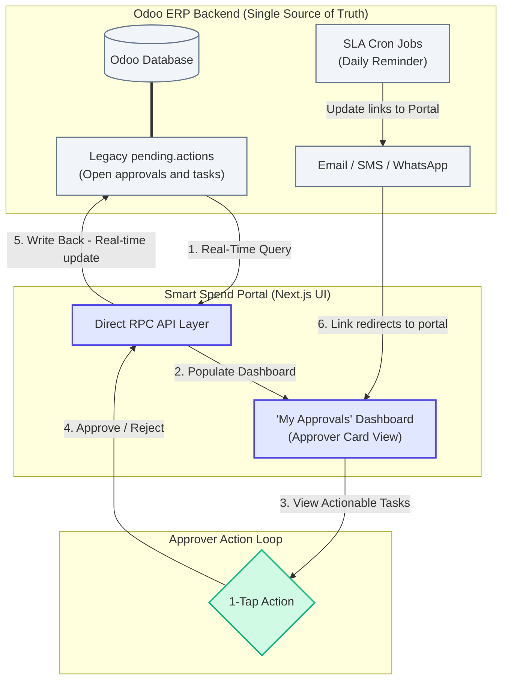

# Smart Spend Request Platform: Usability & Workflow Guide

This document presents a detailed breakdown of the proposed **Smart Spend Request Platform**, highlighting how it simplifies, automates, and abstracts the complex Procure-to-Pay (P2P) workflows currently running in the Odoo 15 ERP. It serves as a manager-ready guide to explain the project's value proposition, user-centered design, and backend governance.

---

## 1. Executive Summary: The Usability Vision

Traditional ERP platforms force employees to navigate dense menus, select obscure cost center codes, and manually cross-reference rate contracts. The **Smart Spend Request Platform** is built on a simple philosophy: **"Request Anything. Track Everything. Understand Nothing [of the ERP complexity]."**

By decoupling the user interface from Odoo 15 and inserting an **AI-driven Orchestration Layer**, we deliver a consumer-like purchasing experience for corporate requesters while maintaining strict ERP backend compliance and procurement governance.

---

## 2. Current Odoo 15 P2P Pain Points

In the existing Odoo 15 customization:
1. **Form Complexity**: Initiators must select Company, Bill-To, Ship-To, Department, Expense Type (CapEx/OpEx), Category, Purchase Plan, and Purchase Type, before entering product details.
2. **Contract Ambiguity**: Requesters do not know if a product has an active Rate Contract (`product.tender.line`), leading to confusion on pricing and suppliers.
3. **Manual Sourcing Operations**: If no contract exists, a manual "Need for Contract" approval is raised. Buyers must be assigned manually, and quote comparison is handled externally or via dense forms.
4. **Approval Delays**: Managers are forced to review complex product request pages containing ERP-centric fields rather than clean decision summaries.
5. **Tracking Black Hole**: Requesters have no visibility into sourcing, legal vetting, or PO confirmation stages, generating high administrative follow-up overhead.

---

## 3. The 3-Swimlane Process Architecture

The table below outlines how the Smart Spend Request Platform distributes complexity across the user portal, the AI orchestration gateway, and the Odoo ERP backend.

| User Interface (Next.js Portal) | AI Integration Layer (Odoo Web Controllers / Next.js) | Odoo ERP Backend (Core Compliance & Database) |
| :--- | :--- | :--- |
| **Simple Raw Text Input**: User enters what they need in natural language. | **NLP Extraction**: Parses text to resolve product category, quantity, target price, and department. | **Master Data Check**: Validates user permissions, active vendors, and products. |
| **1-Click Actions**: Requesters approve budget alternatives or respond to RFIs. | **Smart Routing**: Identifies budget availability, active contracts, and approval rules. | **Budget Reservation**: Deducts `amount_used` on request, and releases on rejection/cancellation. |
| **Timeline Tracker**: Displays simple, courier-style milestones (e.g., "Sourcing"). | **Event Aggregator**: Syncs and maps complex ERP transitions to user-friendly states. | **Sourcing Slices**: Houses the actual RFQ, bidding, and contract signing workflows. |
| **Manager Dashboard**: Displays summarized decision cards (Yes/No approvals). | **Hierarchy Resolution**: Compiles the approval chain based on delegation of authority (DOA). | **Auto-PO & Accounting**: Automates PO generation, GRN matching, and accounting audits. |

---

## 4. Workflow Diagrams (Mermaid)

### Diagram 1: End-to-End Smart Request Master Flow
This master chart outlines the entire lifecycle, showing the decision path when an active Rate Contract exists versus when the system automatically falls back to Odoo contract sourcing.

---

### Diagram 2: Intelligent Request Initiation (NLP Engine)
This workflow details how the system interprets free-form text input to construct structured purchase requests behind the scenes.

---

### Diagram 3: Smart Budget Validation & Alternative Routing
Instead of rejecting a requisition immediately when budget limits are breached, the platform suggests constructive alternative actions to keep the request moving.

---

### Diagram 4: Sourcing Slices & SCM Fallback (No Rate Contract)
When no contract is active, the request triggers Odoo contract sourcing. This workflow outlines buyer workload assignment, bidding methods, and Rate Contract creation.

---

### Diagram 5: Simplified User Request Tracking vs. Odoo Backend
This chart contrasts the user's high-level courier-style tracking view with the dense, multi-stage transaction workflows happening in the background.

---

## 5. Feature-by-Feature Comparison Matrix

| Feature | Existing Odoo 15 P2P Flow | Proposed Smart Spend Request Platform |
| :--- | :--- | :--- |
| **Requisition Entry** | Multi-page form requiring complex ERP configuration inputs (Expense Type, Cost Centers, Purchase Plans). | A single search-style box. Requester types a description or writes in free text. NLP auto-extracts parameters. |
| **Rate Contract Check** | User must manually find valid contract lines or risk creating an uncontracted PR. | Automated matching engine. Checks active Rate Contracts in real-time, auto-attaching vendor & prices. |
| **Budget Enforcement** | Hard block or silent warning at submit time. If blocked, users must restart. | Real-time budget validation. Suggests related accounts or initiates a budget transfer on the fly. |
| **Manager Approvals** | Requires logging into the ERP backend and auditing dense requisition tables. | Unified Approvals Dashboard. Managers see summary cards with budget status, ETA, and a 1-tap Approve button. |
| **SCM Sourcing (CR)** | Manual buyer assignment, external negotiations, and manual comparison of multiple Excel quotes. | Auto-assignment based on category and buyer workload. Vendor portal bidding with automatic bid scorecards. |
| **Tracking Timeline** | Inquirers must search through emails, check picking lines, or call procurement to get a status update. | Courier-style tracking timeline. Pulls live milestones from Odoo (Sourcing -> PO -> GRN -> Paid). |
| **Pending Actions / Tasks** | Tracked via the custom Odoo `pending.actions` model. Users must navigate dense Odoo forms or read daily email digests with links pointing back to Odoo ERP views. | Fully mapped and unified. The Next.js API layer queries Odoo's `pending.actions` database in real-time. Approvers see outstanding tasks as simple cards on the "My Approvals" tab, while requesters track pending details in "My Requests". |
| **Vendor Onboarding & Sourcing** | Requester manually searches for vendors. If unregistered, the buyer must launch a manual onboarding process (`vendor.intake`) requiring multi-level approvals and manual credentials setup before quotes can be collected. | Automated AI Fetching & Onboarding. The system dynamically queries Odoo's registry. If no match is found, AI fetches external supplier leads, automatically registers a draft vendor profile, and sends a passwordless quote submission link (onboarded on the fly). |

---

## 6. Transition & Management of Legacy Pending Actions

When transitioning from the existing Odoo 15 setup to the new **Smart Spend Request Platform**, managing ongoing approvals and open tasks ("Pending Actions") is critical to avoid business interruption. Because the new platform connects directly to Odoo as its backend, the transition is seamless:

1. **No Data Migration Required (Shared Single Source of Truth)**
   - The Odoo 15 ERP remains the master transactional database. All existing `pending.actions` records reside securely in Odoo.
   - The Next.js portal communicates directly with the Odoo API. Therefore, **all active, historical, and draft pending actions from the legacy system are automatically visible** in the new interface on day one without any data migration scripts.

2. **Unified Action Dashboard for Approvers (Odoo Controller & API Integration)**
   - The system queries the Odoo `pending.actions` model where `status = 'open'` and maps the `approve_users` or `assigned_to` fields to the logged-in user.
   - These tasks are compiled into a user-friendly card layout in the Next.js UI (**"My Approvals"** dashboard). Approvers perform 1-tap actions directly from the portal, which updates the Odoo record state via direct JSON-RPC/XML-RPC API calls.

3. **Courier-Style Timeline for Requesters**
   - The platform queries Odoo's status logs and related records to construct the simple tracking timeline (e.g., displaying which manager or SCM buyer currently holds the request).
   - This hides technical Odoo status codes behind simple milestones.

4. **SLA Notification & Email Routing Alignment**
   - The existing Odoo daily crons (`send_pending_actions_email` and `_send_pending_actions_email_initiator`) remain active to ensure continuity.
   - Email templates are updated to point action links directly to the new Next.js portal pages rather than Odoo ERP backend URLs.
   - We can expand this to support instant WhatsApp/SMS notifications using Odoo webhook endpoints whenever a new `pending.actions` row is created.

### Diagram 6: Legacy Pending Actions Sync and Management Workflow
This diagram illustrates how legacy approvals are synced in real-time, how action links redirect to the portal, and how Odoo processes write-backs.

---

## 7. AI-Powered Vendor Fetching & Frictionless Onboarding

To maximize user convenience and eliminate the friction of manually searching, inviting, and onboarding new vendors, the platform replaces the legacy, complex Odoo `vendor.intake` workflow with an **AI-Driven Vendor Fetching & On-The-Fly Onboarding** model:

1. **Semantic Category Parsing**
   - When a requester inputs free text (e.g., *"I need 10 conference room chairs"*), the AI extraction engine identifies the category (e.g., *Office Furniture*).
   
2. **AI Vendor Recommendation**
   - The system first queries Odoo's internal vendor registry (`res.partner`) for existing suppliers with matches under that category, ranking them by geographic proximity, historical SLA performance, and lead times.
   - If no suitable contract or internal supplier is found, the **AI Sourcing Engine** queries external B2B directories and catalogs (via secure API search integrations) to fetch and score the best external vendor candidates.

3. **Auto-Creation of Draft Partner (On-The-Fly Onboarding)**
   - When the user selects a recommended external vendor, the system automatically creates a **Draft Partner** in Odoo (`res.partner`) using basic contact details, tax numbers, and email addresses fetched by the AI.
   - This completely bypasses the legacy manual `vendor.intake` form and its multi-stage prerequisite approval loops.

4. **Passwordless Magic Quote Invitation**
   - The system auto-generates a secure, token-based link and emails it to the vendor.
   - The vendor clicks the link to access a lightweight upload page (no registration or passwords required) where they drag-and-drop their quote PDF.
   
5. **AI PDF Quote Reader**
   - The portal's AI reader parses the uploaded quote PDF, automatically extracting item descriptions, quantities, unit prices, tax percentages, and terms.
   - It populates the corresponding Odoo RFQ lines and runs the composite scorecard comparison against other vendors.
   
6. **Promotion to Approved Vendor**
   - Once the best bid is recommended by the algorithm and the final purchase request is approved, Odoo automatically elevates the Draft Partner to an **Approved Vendor**, finalizing the procurement contract in one seamless flow.
